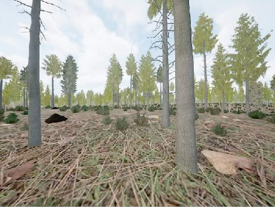
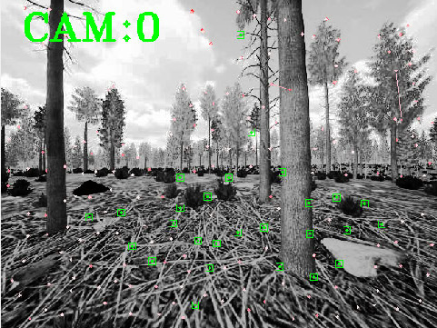
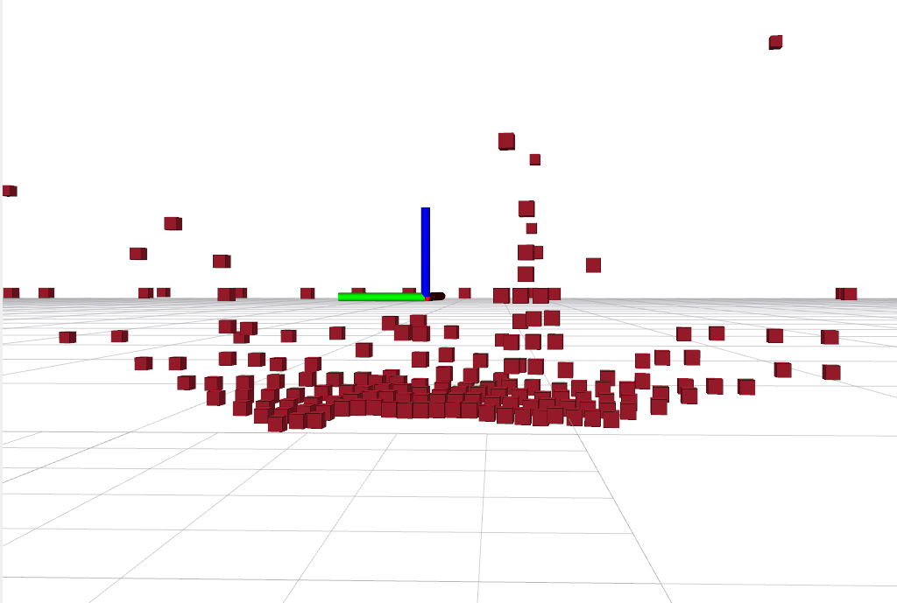

# Monocular Vision-Based UAV Navigation in Large-Scale Unstructured Environments

A monocular camera-based navigation pipeline for UAVs in unstructured environments. The system converts relative depth maps from [MiDaS](https://github.com/isl-org/MiDaS) models into metric estimates using sparse VIO landmarks from OpenVINS, and uses the resulting point cloud for either reactive navigation or OctoMap-based path planning.

**Bachelor's Thesis** — Czech Technical University in Prague, Faculty of Electrical Engineering, Department of Cybernetics

> **Source code:** [github.com/your-username/monodepth_navigation](https://github.com/MrTomzor/monodepth_navigation/tree/ros2)  
> *(Replace with your actual repository URL)*

---

<table>
  <tr>
    <td align="center" width="25%"><b>RGB Image</b></td>
    <td align="center" width="25%"><b>MiDaS Depth Map</b></td>
    <td align="center" width="25%"><b>OpenVINS Landmarks</b></td>
    <td align="center" width="25%"><b>Point Cloud</b></td>
  </tr>
  <tr>
    <td></td>
    <td></td>
    <td></td>
    <td></td>
  </tr>
</table>

---

## Requirements

- OS: Linux
- ROS 2 Jazzy
- Python 3.12+
- [FlightForge simulator](https://mrs.fel.cvut.cz/flight-forge) — stable release for Linux, launched separately
- [MRS UAV System](https://ctu-mrs.github.io/docs/installation/native-installation)
- [OpenVINS (MRS fork)](https://github.com/ctu-mrs/open_vins)

---

## Installation

## Installation

**1. Extract the archive and place it in your ROS 2 workspace:**
```bash
unzip monodepth_navigation-ros2.zip -d ~/ros2_ws/src/
```


**2. Build the workspace:**
```bash
cd ~/ros2_ws
colcon build
source install/setup.bash
```

**3. Set up the Python environment:**
```bash
./create_python_env.sh
./install_requirements.sh
```

---

## Launch Files

The pipeline has two main launch files in the `launch/` directory.

### `monodepth.launch.py` — Depth Estimation Node

Runs MiDaS depth estimation and produces a scaled metric point cloud. All input and output topic names are configurable via parameters:

| Parameter | Description |
|---|---|
| `input_img_topic` | RGB camera image topic |
| `input_camera_info_topic` | Camera calibration info topic |
| `input_pointcloud_topic` | Sparse VIO landmarks from OpenVINS  |
| `camera_frame` | Camera TF frame name |
| `world_frame` | World/origin TF frame name |
| `output_pointcloud_topic_map` | Output point cloud in map frame (fed into navigation) |
| `output_pointcloud_topic_value` | Output point cloud scaled by value |
| `output_depth_map_topic` | Raw MiDaS depth map (visualization) |
| `output_scaled_depth_map_topic_map` | Scaled metric depth map (visualization) |

### `navigation.launch.py` — Navigation Node

Controls the UAV toward a goal using the point cloud from the depth estimation node. The navigation strategy is selected via the `is_reactive` parameter:

| Parameter | Description |
|---|---|
| `is_reactive` | `true` for reactive navigation, `false` for OctoMap-based planning (default: `false`) |
| `input_pointcloud_topic` | Should match the output of `monodepth.launch.py` |


---

## Navigation Modes

### Reactive Navigation
Simple forward-flight with obstacle avoidance based on sector-based point cloud analysis. The UAV flies forward and rotates away from obstacles when detected within configurable distance thresholds. Constrained to a horizontal plane.

### OctoMap-Based Planning
The UAV builds a 3D occupancy map incrementally and uses it to plan collision-free paths toward a goal position. Supports full 3D navigation including vertical adjustments.

---

## Running in Simulation

The pipeline is evaluated using the [FlightForge](https://mrs.fel.cvut.cz/flight-forge) simulator. Refer to the [FlightForge documentation](https://ctu-mrs.github.io/docs/simulations/FlightForge/configuration) for details on installation and world configuration.

> **Note:** The FlightForge simulator must be started separately in its own terminal before launching the tmux session.

Three pre-configured simulation worlds are provided under `tmux/unreal/`:

| World | Path |
|---|---|
| Forest | `tmux/unreal/forest/` |
| Infinity Forest | `tmux/unreal/infinity_forest/` |
| Electric Towers | `tmux/unreal/electric_towers/` |

**To launch a world:**
```bash
cd tmux/unreal/forest   # or infinity_forest / electric_towers
./start.sh
```

This starts a tmux session with all required nodes (ROS middleware, simulator bridge, VIO, MRS UAV core, OctoMap mapping, monodepth estimation, and navigation). The UAV will take off automatically and begin navigating toward the pre-configured goal.

### Session Configuration (`session.yml`)

Each world directory contains a `session.yml` that defines the tmux session layout and the launched nodes. The navigation goal is set here directly in the `navigation` pane as launch arguments to `navigation.launch.py`, for example:

```bash
ros2 launch monodepth_navigation navigation.launch.py \
    uav_name:=$UAV_NAME \
    x_octogoal:=100.0 y_octogoal:=0.0 z_octogoal:=0.0 yaw_octogoal:=0.0
```

Adjust these values to change where the UAV flies in each world.

### World Configuration (`config/`)

Each world's `config/` folder contains files that control the simulation and planning behaviour:

**`simulator.yaml`** — FlightForge simulator settings:
- World name (e.g. `infinite_forest`, `forest`, `eletric_towers`)
- Graphics quality (`low` / `medium` / `high`)
- Sensor configuration (camera rate, orientation, lidar enable/disable)
- UAV spawn position and heading
- Environment parameters (forest density, terrain hilliness)

**`mapplan_config.yaml`** — OctoMap mapping and path planning settings, passed to the `mrs_octomap_mapping_planning` package.

See the [FlightForge documentation](https://ctu-mrs.github.io/docs/simulations/FlightForge/configuration) for the full list of configurable parameters.

